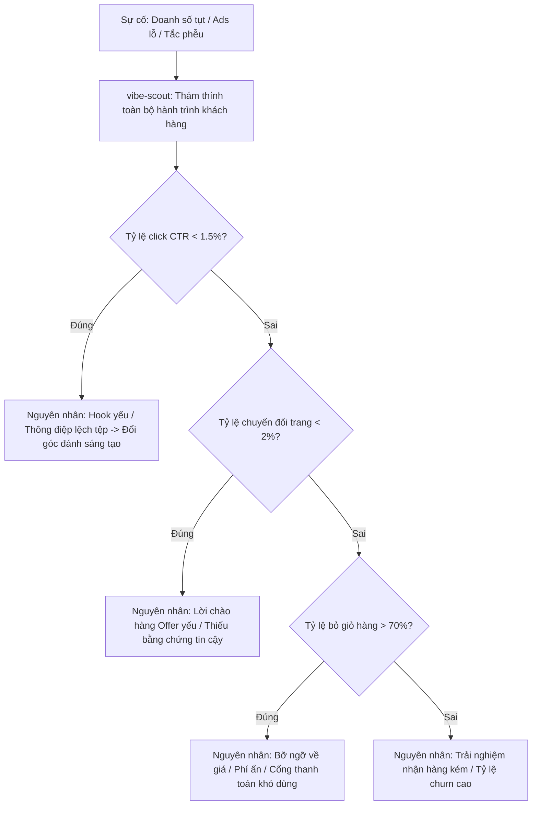

<div align="center">

# ⚡ VIBE STORM SUITE

### Bộ 5 Kỹ Năng Agent Chuẩn Mực Cho Yêu Cầu Kinh Doanh, Khởi Nghiệp & Vibe Working
*(Trích xuất và chuyển hóa qua `/ak:xia` từ 5 kỹ năng cốt lõi của AgentKit)*

[](https://opensource.org/licenses/MIT)
[](https://code.claude.com)
[](https://cursor.com)
[](https://agentskills.io)
[](https://github.com/abm-dungtq/vibe-storm)

*Không dừng lại ở tài liệu lý thuyết, Vibe Storm đóng gói trọn vẹn 5 sub-skills độc lập vận hành xuyên suốt chuỗi cung ứng giá trị thương mại 5 bước: Đóng khung ý tưởng $\to$ Nghiên cứu đối thủ $\to$ Thám thính phễu $\to$ Lập kế hoạch phân kỳ $\to$ Thực thi chốt đơn.*

---

[Bộ 5 Kỹ Năng Độc Lập](#-1-b%E1%BB%99-5-k%E1%BB%B9-n%C4%83ng-%C4%91%E1%BB%99c-l%E1%BA%ADp-ported-via-akxia) • [Bản Hợp Đồng Bounded](#-2-b%E1%BA%A3n-h%E1%BB%A3p-%C4%91%E1%BB%93ng-kinh-doanh-%C4%91%C3%B3ng-khung-bounded-contract) • [Chẩn Đoán Sự Cố Doanh Thu](#-3-ch%E1%BA%A9n-%C4%91o%C3%A1n-s%E1%BB%B1-c%E1%BB%91-doanh-thu-bug-routing) • [Cài Đặt & Sử Dụng](#-4-h%C6%B0%E1%BB%9Bng-d%E1%BA%ABn-c%C3%A0i-%C4%91%E1%BA%B7t-1-ch%E1%BA%A1m) • [Ví Dụ Thực Tế](#-5-v%C3%AD-d%E1%BB%A5-c%C3%A2u-l%E1%BB%87nh-th%E1%BB%B1c-chi%E1%BA%BFn)

---

</div>

## 🏛️ 1. Bộ 5 Kỹ Năng Độc Lập (Ported via `/ak:xia`)

Hệ thống được bóc tách và tinh chỉnh từ 5 kỹ năng nền tảng của AgentKit, biến thành 5 công cụ độc lập dành riêng cho bài toán kinh doanh:

$$\mathbf{[vibe\text{-}storm]} \longrightarrow \mathbf{[vibe\text{-}research]} \longrightarrow \mathbf{[vibe\text{-}scout]} \longrightarrow \mathbf{[vibe\text{-}plan]} \longrightarrow \mathbf{[vibe\text{-}cook]}$$

| Bước | Lệnh Trực Tiếp | Skill Gốc AgentKit | Vai Trò Chuyên Biệt Trong Kinh Doanh |
| :---: | :--- | :--- | :--- |
| **1** | **`/vibe-storm`** | `ak:brainstorm` | **Đóng Khung Hợp Đồng Thương Mại (Bounded Contract):** Khóa chặt 4 trường *Outcome, Constraints, Non-goals, Acceptance Criteria*; So sánh 3 phương án kinh doanh; Chẩn đoán sự cố doanh thu (*Bug routing*). |
| **2** | **`/vibe-research`** | `ak:research` | **Nghiên cứu Thị Trường 4 Pha:** Khảo sát đối thủ cạnh tranh (tối đa 5 truy vấn sâu), bóc tách cấu trúc giá, phân tích khoảng trống giá trị (*Value Gap*), tìm kiếm rào cản mua hàng. |
| **3** | **`/vibe-scout`** | `ak:scout` | **Thám Thính Hiện Trạng & Phễu:** Kiểm kê tài sản số sẵn có (email list, case studies), đo lường tỷ lệ rơi rụng khách hàng qua từng tầng phễu (*Funnel drop-off audit*). |
| **4** | **`/vibe-plan`** | `ak:plan` | **Lập Kế Hoạch Phân Kỳ (Files-First):** Khởi tạo cấu trúc `plans/<slug>/plan.md` cùng 4 phase (`phase-01-offer.md` đến `phase-04-launch.md`), ma trận nghiệm thu thương mại & bảng rủi ro. |
| **5** | **`/vibe-cook`** | `ak:cook` | **Thực Thi Sản Xuất & Chốt Đơn:** Chế tác từng phase theo kế hoạch: Viết sales copy, dựng landing page, cấu hình cổng thanh toán (Stripe/VietQR/SePay), tự động hóa gửi email và đo lường đơn hàng. |

---

## 📋 2. Bản Hợp Đồng Kinh Doanh Đóng Khung (Bounded Contract)

Khi bắt đầu bất kỳ một ý tưởng kinh doanh hay chiến dịch nào với `/vibe-storm`, hệ thống bắt buộc phải thiết lập bản hợp đồng 4 trường để chống bẫy phình to quy mô (scope creep):

- **🎯 Outcome:** Trạng thái đích thương mại đo lường được (Ví dụ: "10 khách hàng trả phí \$1,500/tháng, MRR \$15k sau 60 ngày").
- **🔒 Constraints:** Ràng buộc thực tế (Ngân sách \$0 tiền ads, hoàn thành trong 7 ngày, biên lợi nhuận ròng $\ge 80\%$).
- **🚫 Non-goals:** Phạm vi từ chối — Những việc **TUYỆT ĐỐI KHÔNG LÀM** (Không tuyển thêm nhân sự, không phát triển tính năng phụ rườm rà).
- **✅ Acceptance Criteria:** Bằng chứng nghiệm thu thực tế (Có 5 hợp đồng đặt cọc trước, trang đích đạt chuyển đổi $\ge 3\%$).

---

## 🔍 3. Chẩn Đoán Sự Cố Doanh Thu (Bug Routing)

Khi một chiến dịch kinh doanh bị tắc nghẽn (ads cắn tiền không ra đơn, landing page nhiều view nhưng không ai mua), `vibe-storm` áp dụng quy trình **Bug Routing** nghiêm ngặt — **chẩn đoán nguyên nhân gốc rễ trước khi sửa chữa**:



---

## 🚀 4. Hướng Dẫn Cài Đặt 1 Chạm

### Cài đặt tự động toàn bộ 5 skills:
```bash
curl -fsSL https://raw.githubusercontent.com/abm-dungtq/vibe-storm/main/scripts/install.sh | bash
```

Lệnh trên sẽ tự động:
- Cài đặt 5 skills vào **Claude Code** (`~/.claude/skills/`).
- Cài đặt 5 skills vào **Antigravity / Gemini CLI** (`~/.gemini/config/skills/`).
- Kích hoạt 5 rules tương ứng trong **Cursor IDE** (`.cursor/rules/`).

---

## 💻 5. Ví Dụ Câu Lệnh Thực Chiến Cho Từng Bước

Bạn có thể chạy toàn bộ quy trình liên hoàn hoặc gọi riêng lẻ từng bước tùy theo tình huống:

### Bước 1: Khởi tạo ý tưởng & Đóng khung hợp đồng
```bash
/vibe-storm "Dịch vụ AI Ops tự động hóa chăm sóc khách hàng cho phòng khám nha khoa" --biz --html
```

### Bước 2: Nghiên cứu thị trường & Bóc tách đối thủ
```bash
/vibe-research "Thị trường phần mềm và dịch vụ đặt lịch hẹn tự động cho nha khoa tại Việt Nam"
```

### Bước 3: Thám thính phễu & Rà soát điểm nghẽn
```bash
/vibe-scout "Landing page đặt lịch hẹn nha khoa hiện tại đang có tỷ lệ thoát 85%"
```

### Bước 4: Lập kế hoạch hành động phân kỳ 4 Phase
```bash
/vibe-plan "Kế hoạch ra mắt dịch vụ đóng gói AI Ops trong 7 ngày" --html
```

### Bước 5: Thực thi sản xuất tài sản & Chốt đơn
```bash
/vibe-cook ./plans/260904-launch-ai-ops/plan.md --interactive
```

---

## 🗂️ 6. Cấu Trúc Repository Đầy Đủ

```text
vibe-storm/
├── .claude-plugin/           # Plugin catalog đăng ký trọn bộ 5 skills
├── .cursor/rules/            # 5 file rule mdc tương ứng cho Cursor IDE
├── skills/
│   ├── vibe-storm/           # [Bước 1] Brainstorm & Điều phối (Port từ ak:brainstorm)
│   ├── vibe-research/        # [Bước 2] Market & Competitor Research (Port từ ak:research)
│   ├── vibe-scout/           # [Bước 3] Funnel & Asset Scout (Port từ ak:scout)
│   ├── vibe-plan/            # [Bước 4] Phased Business Planning (Port từ ak:plan)
│   └── vibe-cook/            # [Bước 5] Commercial Execution & Production (Port từ ak:cook)
├── templates/
│   └── vibe-board-template.html
├── scripts/
│   ├── install.sh            # Cài đặt trọn bộ 5 skills
│   ├── quick_validate.py     # Kiểm tra tính hợp lệ của cả 5 skills
│   └── generate_board.py     # CLI sinh file HTML trực tiếp từ terminal
└── README.md
```

---

## 🤝 Giấy Phép

Phát hành dưới giấy phép mã nguồn mở **[MIT License](LICENSE)**.  
Được phát triển bởi **[abm-dungtq](https://github.com/abm-dungtq)**.
