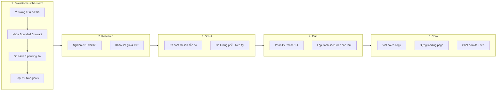
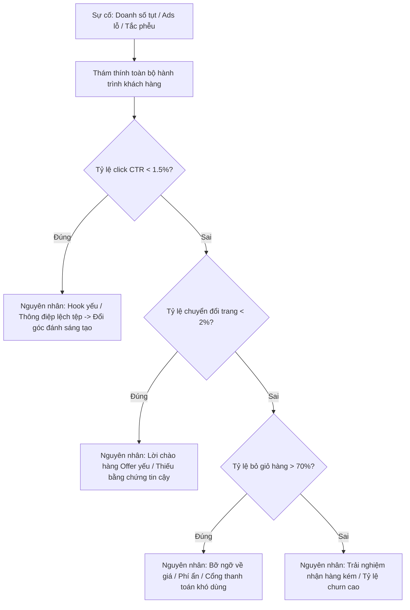

<div align="center">

# ⚡ VIBE STORM

### Cỗ Máy Brainstorm & Đóng Khung Yêu Cầu Kinh Doanh Chuẩn Mực Dành Cho Solopreneur, Nhà Sáng Lập & Vibe Working

[](https://opensource.org/licenses/MIT)
[](https://code.claude.com)
[](https://cursor.com)
[](https://agentskills.io)
[](https://github.com/abm-dungtq/vibe-storm)

*Chuyển hóa mọi ý tưởng thương mại mơ hồ thành Bản Hợp Đồng Kinh Doanh Đóng Khung (Bounded Contract), so sánh các phương án chiến lược theo kịch bản xấu nhất, và vận hành mượt mà trên chuỗi 5 bước tiêu chuẩn của AI Agent.*

---

[Triết Lý Cốt Lõi](#-1-t%E1%BA%A1i-sao-vibe-storm-ra-%C4%91%E1%BB%9Di) • [Quy Trình 5 Bước](#-2-chu%E1%BB%97i-pipeline-5-b%C6%B0%E1%BB%9Bc-ti%C3%AAu-chu%E1%BA%A9n) • [Bản Hợp Đồng Bounded](#-3-b%E1%BA%A3n-h%E1%BB%A3p-%C4%91%E1%BB%93ng-kinh-doanh-%C4%91%C3%B3ng-khung-bounded-contract) • [Chẩn Đoán Sự Cố (Bug Routing)](#-4-ch%E1%BA%A9n-%C4%91o%C3%A1n-s%E1%BB%B1-c%E1%BB%91-doanh-thu-business-bug-routing) • [4 Phân Hệ Nghiệp Vụ](#-5-b%E1%BB%99-4-ph%C3%A2n-h%E1%BB%87-nghi%E1%BB%87p-v%E1%BB%A5-chuy%C3%AAn-s%C3%A2u) • [5 Mô Hình Kinh Doanh](#-6-h%E1%BB%97-tr%E1%BB%A3-5-m%C3%B4-h%C3%ACnh-kinh-doanh-th%E1%BB%9Di-%C4%91%E1%BA%A1i-ai) • [Cài Đặt & Sử Dụng](#-7-h%C6%B0%E1%BB%9Bng-d%E1%BA%ABn-c%C3%A0i-%C4%91%E1%BA%B7t--s%E1%BB%AD-d%E1%BB%A5ng)

---

</div>

## 💡 1. Tại Sao Vibe Storm Ra Đời?

Trong kỷ nguyên **Vibe Working** và **Solopreneur**, các dự án kinh doanh thất bại **không phải vì thiếu ý tưởng hay lười biếng**, mà vì 3 cái bẫy chết người:
1. **Ý định mơ hồ (Vague Intent):** Bắt tay vào làm nhưng không định lượng được mục tiêu doanh thu, không rõ bán cho ai và không biết khi nào là hoàn thành.
2. **Phình to phạm vi (Scope Creep):** Cố gắng phục vụ tất cả mọi người, thêm hàng chục tính năng thừa thãi, sa đà vào tối ưu hóa sớm khi chưa có nổi 1 khách hàng trả tiền.
3. **Ảo tưởng màu hồng (Optimism Bias):** Lập kế hoạch dựa trên kịch bản lý tưởng nhất, không lường trước điểm gãy xấu nhất (worst-case failure) khi thị trường từ chối.

**Vibe Storm** kế thừa trọn vẹn kỷ luật kỹ thuật của `ak:brainstorm`, đưa tư duy đóng khung hợp đồng vào **Yêu cầu Kinh doanh (Business Requirements)**. Nó hoạt động như một **cánh cổng bắt buộc (front-door gate)** giúp bạn thẩm định tính khả thi thương mại trước khi đầu tư thời gian, tiền bạc vào nghiên cứu, lập kế hoạch hay thực thi.

---

## 🏛️ 2. Chuỗi Pipeline 5 Bước Tiêu Chuẩn

Vibe Storm không hoạt động đơn lẻ mà là mắt xích mở đầu cho chuỗi cung ứng giá trị 5 bước của hệ thống AI Agent:

$$\mathbf{[1.\ Brainstorm]} \longrightarrow \mathbf{[2.\ Research]} \longrightarrow \mathbf{[3.\ Scout]} \longrightarrow \mathbf{[4.\ Plan]} \longrightarrow \mathbf{[5.\ Cook]}$$



### Chi tiết nhiệm vụ từng bước trong Business:
- **1. Brainstorm (`vibe-storm`):** Đóng khung yêu cầu thành hợp đồng 4 trường, chẩn đoán nguyên nhân gốc rễ nếu là sự cố doanh thu, so sánh tối đa 3 hướng đi dựa trên kịch bản xấu nhất.
- **2. Research:** Đào sâu phân tích thị trường: Top 3 đối thủ cạnh tranh, mức giá thị trường, tâm lý từ chối mua hàng (objections), và rào cản ngành.
- **3. Scout:** Thám thính hiện trạng doanh nghiệp: Danh sách email hiện có, lượng truy cập thực tế, tỷ lệ rớt khách ở các bước trong phễu, năng lực nhân sự/công cụ.
- **4. Plan:** Lập kế hoạch hành động phân kỳ (Phase 1: Offer & Funnel $\to$ Phase 2: Content & Kênh $\to$ Phase 3: Thanh toán $\to$ Phase 4: Ra mắt & Chốt đơn).
- **5. Cook:** Bắt tay vào chế tác tài sản thực tế: Viết bài bán hàng, dựng trang thanh toán, cấu hình automation gửi email, gửi tin nhắn outreach và đo lường chuyển đổi.

---

## 📋 3. Bản Hợp Đồng Kinh Doanh Đóng Khung (Bounded Contract)

Mọi yêu cầu kinh doanh được đưa vào `vibe-storm` đều bắt buộc phải vượt qua cánh cổng 4 trường dữ liệu. Nếu chưa rõ, hệ thống sẽ chỉ hỏi **tối đa 1 câu hỏi trọng tâm nhất** thay vì khảo sát rườm rà:

```markdown
### 🎯 1. Outcome (Trạng thái đích thương mại)
Kết quả kinh doanh cụ thể, có thể đo lường chính xác bằng số liệu:
- Doanh thu mục tiêu (MRR / ARR / Tổng doanh số đợt launch).
- Số lượng khách hàng trả phí hoặc hợp đồng ký kết.
- Tỷ lệ chuyển đổi tối thiểu trên trang bán hàng.

### 🔒 2. Constraints (Ràng buộc thực tế)
Các giới hạn không thể phá vỡ:
- Ngân sách tối đa (Max Budget) & Trần chi phí thu hút khách hàng (Max CAC).
- Thời hạn ra mắt (Timeline, ví dụ: hoàn thành trong 48 giờ hoặc 7 ngày).
- Biên lợi nhuận ròng tối thiểu (Gross margin >= 80%).
- Ràng buộc về pháp lý, nguồn lực nhân sự, hoặc đạo đức thương hiệu.

### 🚫 3. Non-goals (Phạm vi từ chối — Chống phình to quy mô)
Danh sách những việc TUYỆT ĐỐI KHÔNG LÀM ở giai đoạn này:
- Không tuyển thêm nhân sự hay thuê ngoài phức tạp.
- Không xây dựng tính năng phụ hay cổng thanh toán rườm rà.
- Không đốt tiền vào quảng cáo trả phí (Paid Ads) nếu chưa kiểm chứng hữu cơ.

### ✅ 4. Acceptance Criteria (Tiêu chí nghiệm thu thực tế)
Bằng chứng thương mại không thể chối cãi để chứng minh hoàn thành:
- Có ít nhất 10 đơn đặt cọc trước (Pre-orders) hoặc 3 hợp đồng ký quỹ.
- Trang bán hàng đạt tỷ lệ chuyển đổi >= 3% trên 500 lượt truy cập đầu tiên.
- Luồng giao hàng / cấp tài khoản tự động hoàn tất trong dưới 60 giây.
```

---

## 🔍 4. Chẩn Đoán Sự Cố Doanh Thu (Business Bug Routing)

Khi một chiến dịch kinh doanh bị tắc nghẽn (quảng cáo cắn tiền không ra đơn, landing page nhiều view nhưng không ai mua, khách dùng thử nhưng không gia hạn), `vibe-storm` áp dụng quy trình **Bug Routing** nghiêm ngặt — **không bao giờ đoán mò giải pháp từ triệu chứng**:



---

## ⚖️ 5. So Sánh Phương Án Theo Kịch Bản Xấu Nhất (Worst-Case Condition)

Khi đứng trước nhiều lựa chọn chiến lược, `vibe-storm` so sánh tối đa 3 phương án khả thi dựa trên **Điểm gãy trong kịch bản tồi tệ nhất**, không chỉ nhìn vào viễn cảnh màu hồng:

| Phương án Chiến Lược | Giả Định Gánh Tải (Load-bearing) | Điểm Gãy Xấu Nhất (Worst-case Failure) | Đánh Giá Khuyến Nghị |
| :--- | :--- | :--- | :--- |
| **A. Kéo Khách Hữu Cơ (Organic Content)** | Tệp khách hàng mục tiêu chủ động xem và chia sẻ video ngắn trên TikTok/Reels/X. | Thuật toán thay đổi phân phối, mất 3 tháng không có đơn hàng nào, cạn kiệt năng lượng sản xuất nội dung. | Phù hợp khi có kỹ năng làm content tốt, vốn \$0, không bị áp lực thời gian. |
| **B. Tiếp Cận Trực Tiếp (Outbound 1:1 DMs)** | Danh sách khách hàng tiềm năng có thể tìm thấy công khai trên LinkedIn, Facebook hoặc X. | Tỷ lệ phản hồi dưới 5%, bị tài khoản chặn do spam nếu kịch bản thiếu tính cá nhân hóa. | **Khuyến nghị số 1 cho dịch vụ giá trị cao (High-ticket):** Nhanh có khách nhất, chi phí \$0. |
| **C. Chạy Quảng Cáo Phễu (Paid Ads)** | Giá trị vòng đời khách hàng (LTV) đủ lớn để bù đắp chi phí quảng cáo (CAC $\ge \$50$). | Giá thầu quảng cáo tăng vọt, trang đích chuyển đổi kém khiến dòng tiền âm nặng nề ngay tuần đầu. | Chỉ chạy khi đã kiểm chứng xong Offer và trang bán hàng có chuyển đổi tự nhiên. |

---

## ⚡ 6. Bộ 4 Phân Hệ Nghiệp Vụ Chuyên Sâu

Bạn có thể kích hoạt từng phân hệ bằng các cờ lệnh (`flags`):

### 1. Phân Hệ Kinh Doanh (`--biz`)
- **The Wedge (Điểm chọc thủng thị trường):** Tìm ra 1 bài toán nhỏ nhức nhối nhất mà khách sẵn sàng trả \$19–\$499+ để giải quyết ngay lập tức.
- **Grand Slam Offer:** Tối đa hóa giá trị cảm nhận, đảo ngược hoàn toàn rủi ro (Risk Reversal: hoàn tiền 100% nếu không hiệu quả).
- **Day-1 Cashflow Test:** Kịch bản xác thực dòng tiền trong 24 giờ trước khi bỏ công sức làm sản phẩm (Loom pitch, đặt cọc \$1, bán trước).

### 2. Phân Hệ Marketing (`--mkt`)
- **Định Vị & Góc Đánh (Positioning):** Lý do duy nhất khách hàng chọn bạn thay vì đối thủ.
- **Ma Trận Hook-Offer-Angle:** 3 góc thông điệp: Đánh vào nỗi đau cũ (Pain), Vẽ ra viễn cảnh mới (Dream), và Phá vỡ định kiến ngành (Contrarian).
- **Vùng Trũng Khách Hàng (Watering Holes):** 3 hội nhóm, cộng đồng, subreddit chính xác nơi khách hàng tiềm năng xuất hiện mỗi ngày.

### 3. Phân Hệ Nội Dung Bán Hàng (`--content`)
- **4 Trụ Cột Content That Sells:** Nội dung để tạo doanh thu (Vạch trần nỗi đau, Bằng chứng chuyển đổi, Hành trình hậu trường, Lời kêu gọi mua hàng).
- **Format Multiplier (1 Ý tưởng $\to$ 4 Tài sản):** 1 bài phân tích chuyên sâu $\to$ 1 chuỗi X Thread $\to$ 2 kịch bản video ngắn (Hook 3s $\to$ Retain $\to$ Reward $\to$ CTA) $\to$ 1 bộ ảnh Carousel.

### 4. Phân Hệ Triển Khai Go-To-Market 48h (`--sprint`)
- **Giờ 00 – 12:** Khóa chặt Offer, định giá, dựng trang bán hàng 1 trang (Framer / Carrd / Gumroad).
- **Giờ 12 – 24:** Đóng gói tài sản cốt lõi (Mẫu template, quy trình tự động hóa, hoặc công cụ MVP).
- **Giờ 24 – 36:** Đấu nối cổng thanh toán (Stripe / VietQR / SePay) và quy trình giao hàng tự động.
- **Giờ 36 – 48:** Nhắn tin tiếp cận 50 khách hàng tiềm năng đầu tiên để chốt đơn hàng đầu tiên (First Dollar).

---

## 🏢 7. Hỗ Trợ 5 Mô Hình Kinh Doanh Thời Đại AI

Vibe Storm hỗ trợ toàn diện các mô hình kinh doanh tinh gọn của Solopreneur:

```text
               ┌── 1. Productized Service / AI Agency (Dịch vụ đóng gói: $500 - $2,000/tháng)
               ├── 2. Digital Assets & Info (Sản phẩm số: Templates, Khóa học, Cộng đồng)
VIBE STORM ────┼── 3. Micro-SaaS & AI Tools (Công cụ phần mềm ngách giải quyết 1 tác vụ)
               ├── 4. Niche E-commerce & Brand (Bán lẻ ngách hoặc Print-on-Demand)
               └── 5. High-Ticket Consulting & AI Ops (Tư vấn triển khai AI cho doanh nghiệp)
```

---

## 🚀 8. Hướng Dẫn Cài Đặt & Sử Dụng

### Cài đặt tự động 1 lệnh duy nhất:
```bash
curl -fsSL https://raw.githubusercontent.com/abm-dungtq/vibe-storm/main/scripts/install.sh | bash
```

### Cài đặt thủ công theo từng nền tảng:

#### 1. Claude Code
```bash
git clone https://github.com/abm-dungtq/vibe-storm.git ~/.claude/skills/vibe-storm
```

#### 2. Cursor IDE
Tải rule kích hoạt vào workspace hiện tại của bạn:
```bash
mkdir -p .cursor/rules
curl -fsSL https://raw.githubusercontent.com/abm-dungtq/vibe-storm/main/.cursor/rules/vibe-storm.mdc -o .cursor/rules/vibe-storm.mdc
```

#### 3. Google Antigravity / Gemini CLI
```bash
mkdir -p ~/.gemini/config/skills/
git clone https://github.com/abm-dungtq/vibe-storm.git ~/.gemini/config/skills/vibe-storm
```

---

## 💻 9. Ví Dụ Câu Lệnh Thực Tế

```bash
# 1. Đóng khung hợp đồng kinh doanh toàn diện + Xuất Dashboard HTML
/vibe-storm "Dịch vụ AI Ops tự động hóa đặt lịch cho phòng khám nha khoa" --full --html

# 2. Xử lý sự cố doanh thu (Business Bug Routing) khi quảng cáo bị lỗ
/vibe-storm "Chiến dịch quảng cáo Facebook tốn 15 triệu ra nhiều tin nhắn nhưng không ai mua" --advice

# 3. Tạo Lời chào hàng Grand Slam Offer & Bài test dòng tiền 24h
/vibe-storm --biz "Gói dịch vụ chỉnh sửa video ngắn đóng gói cho các B2B Founder"

# 4. Tìm kiếm góc đánh Marketing và xác định kênh phân phối du kích
/vibe-storm --mkt "Bộ template Notion quản lý tài chính cho người làm tự do (freelancer)"

# 5. Lên kế hoạch sản xuất content bán hàng 30 ngày kèm kịch bản video ngắn
/vibe-storm --content "Khóa học thực chiến ứng dụng AI tự động hóa công việc văn phòng"

# 6. Lập kế hoạch hành động thần tốc Go-To-Market 48 giờ
/vibe-storm --sprint "Cộng đồng trả phí kết nối các nhà sáng lập solo kiếm tiền từ AI"
```

---

## 🗂️ 10. Cấu Trúc Repository

```text
vibe-storm/
├── .claude-plugin/           # Cấu hình phân phối trên Claude Plugin Marketplace
│   ├── marketplace.json
│   └── plugin.json
├── .cursor/rules/            # Cấu hình tự động kích hoạt cho Cursor IDE
│   └── vibe-storm.mdc
├── skills/
│   └── vibe-storm/
│       ├── SKILL.md          # Đặc tả kỹ thuật skill chuẩn AgentSkills (<300 dòng)
│       └── references/
│           ├── vibe-frameworks.md    # Các mẫu hợp đồng, chẩn đoán phễu, công thức Offer
│           ├── execution-bridge.md   # Hướng dẫn kết nối chuỗi 5 bước (Brainstorm->Cook)
│           ├── standalone-prompts.md # Bộ prompt độc lập cho Research, Scout, Plan, Cook
│           └── html-vibe-board.md    # Cấu trúc giao diện HTML Vibe Board tương tác
├── templates/
│   └── vibe-board-template.html      # Mẫu Dashboard HTML dark-mode, glassmorphism
├── scripts/
│   ├── install.sh            # Script cài đặt tự động đa nền tảng
│   ├── quick_validate.py     # Script kiểm tra chuẩn định dạng skill
│   └── generate_board.py     # CLI công cụ sinh trực tiếp file HTML từ Terminal
└── README.md                 # Tài liệu hướng dẫn chuyên sâu 100% tiếng Việt
```

---

## 🤝 Đóng Góp & Giấy Phép

Mọi đóng góp, phản hồi và ý tưởng phát triển đều được hoan nghênh nồng nhiệt qua [GitHub Pull Requests](https://github.com/abm-dungtq/vibe-storm/pulls)!

Dự án được phân phối dưới giấy phép mã nguồn mở **[MIT License](LICENSE)**.  
Được khởi xướng và phát triển bởi **[abm-dungtq](https://github.com/abm-dungtq)**.
