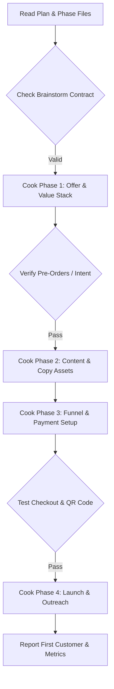

# Vibe Cook (Smart Commercial Execution)

End-to-end commercial execution with automatic workflow detection. Systematically turn planned business phases into live assets, sales pages, email sequences, and paying customers.

Principles: **KISS, DRY | deliver full planned scope | test before launching | cashflow over perfection**

## Usage

```bash
# Execute a full phased plan
/vibe-cook ./plans/260904-launch-ai-ops/plan.md

# Execute a direct commercial deliverable
/vibe-cook "Draft high-converting sales page copy for AI Ops agency" --fast
```

## Execution Modes

- `--interactive`: Step-by-step review with user approval after each phase (**default**).
- `--fast`: Rapid batch generation of assets without intermediate pauses.
- `--auto`: Auto-approves phase progression when all acceptance criteria are verified.
- `--yagni`: Challenge and cut secondary marketing collateral not needed for the core conversion goal.

## Phased Execution Workflow

When passed a plan path (`plans/<slug>/plan.md`):



### 1. Phase 1 Execution: Offer & Value Stack
- Crafts the 1-page Grand Slam Offer document.
- Writes the pricing tier sheet with clear risk-reversal guarantees.
- Generates the Day-1 smoke test script (Loom / DM template).

### 2. Phase 2 Execution: Content & Copy Assets
- Writes high-converting sales page copy following direct-response formulas.
- Drafts 3 short-form video scripts (Hook-Retain-Reward) for social launch.
- Produces a 5-day launch email onboarding sequence.

### 3. Phase 3 Execution: Funnel & Payment Setup
- Implements the landing page structure (Framer / Carrd / Next.js).
- Configures payment links and webhooks (Stripe / VietQR / SePay).
- Tests the complete checkout and confirmation notification loop.

### 4. Phase 4 Execution: Launch & Customer Acquisition
- Drafts 20 personalized outreach DMs for target prospects.
- Publishes launch announcement threads on target social channels.
- Tracks real-world conversion and records first paying customer feedback.

## Commercial Quality Gate

Before marking any phase completed in `plan.md`:
1. Every deliverable file must exist on disk and be fully populated (no empty stubs or placeholder text).
2. The phase verification test must pass (e.g. checkout link returns HTTP 200 and test payment succeeds).
3. Update phase status from `pending` -> `in-progress` -> `completed`.

## Output Summary

Upon completing execution, output a concise commercial launch summary:
- **Assets Created:** File links to sales copy, landing pages, and email sequences.
- **Payment Readiness:** Verified payment URLs and webhook status.
- **Immediate Next Steps:** Specific list of 10 prospects to message today.
## Composable Modes

- `--advice`: Runs under advisory review at each phase checkpoint to inspect sales copy tone, pricing clarity, and checkout friction before launch.
- `--yagni`: Challenge and cut secondary marketing collateral not needed for the core conversion goal.

## References

Load production recipes when cooking sales pages and email campaigns:
- Landing page wireframes and 5-day launch email recipes: `references/execution-recipes.md`
