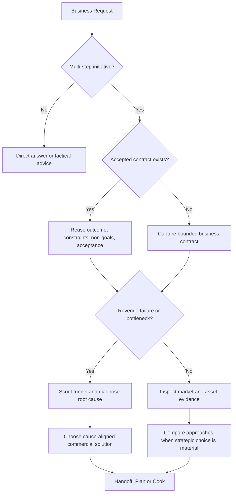

# Vibe Storm

Turn incomplete commercial intent into a bounded delivery contract. Stay honest about market evidence, unit economics, trade-offs, and operational uncertainty without turning a clear request into a ceremonial interview.

## Business Brainstorm Contract

Every multi-step business initiative, product launch, marketing campaign, or revenue delivery starts by capturing:

- **Outcome:** The measurable commercial end-state (revenue target, customer volume, conversion rate, new market entry, or operational milestone).
- **Constraints:** Budget limits, timeline, unit economics (Max CAC, gross margins), regulatory boundaries, brand voice, and team capacity.
- **Non-goals:** Nearby business activities, premature scaling, or adjacent offers that this delivery will **NOT** absorb.
- **Acceptance criteria:** Observable, verifiable commercial evidence that proves completion (e.g. 50 paying customers, $10k MRR, >=3% conversion, signed B2B contract).

An accepted business design or brief satisfies the opening gate when it already contains these fields. Reuse it and identify only material gaps.

## Proportional Behavior

- For a concrete request, summarize the four fields briefly and continue.
- Ask a concise question only when a missing answer would materially alter the business model, unit economics, or legal boundary and cannot be discovered.
- Autonomous execution continues once the four fields are concrete without an unnecessary approval pause.
- Separate business intent from current market evidence. Inspect relevant assets, analytics, or market state before claiming an approach is viable.
- Separate discoverable unknowns (competitor pricing, customer traffic, conversion benchmarks) from unknowable market risks (macro demand, competitor reactions). Resolve discoverable unknowns instead of hedging.

## Business Failure & Bug Routing

When a business initiative fails (ad campaign burning cash, conversion rate drop, high churn, outreach ignored), do **NOT** propose random fixes from symptoms.

1. **Scout the affected funnel:** Map where prospects drop off (Impression -> Click -> Landing Page -> Checkout -> Retention).
2. **Diagnose and prove root cause:** Is the failure in the Offer, the Traffic source, the Messaging, the Pricing, or a technical hurdle?
3. **Compare cause-aligned solutions:** Propose targeted interventions only after proving the root bottleneck.

## Option Exploration

When the business initiative has meaningful strategic choices:

1. Inspect relevant market data, existing funnels, and current assets.
2. State confirmed constraints and evidence gaps.
3. Present up to three viable approaches with meaningful trade-offs:
   - For each, name the **load-bearing assumption** it depends on most.
   - Name the **condition under which it fails first** (worst-case failure condition). Compare on worst plausible cases, not only best.
4. Recommend the smallest, most capital-efficient approach that satisfies the contract. Prefer the approach cheapest to abandon if assumptions fail.
5. Challenge assumptions with evidence. Apply KISS and DRY to business operations. With `--yagni`, cut any vanity metrics or premature complexity.

## Authoritative Flow

## The 5-Stage Agent Delivery Pipeline

Vibe Storm is the front-door gate that precedes and feeds the standard delivery pipeline:

1. **Brainstorm (This Skill):** Frame intent, bounded contract, explore options, and rule out non-goals.
2. **Research:** Deep dive into competitors, benchmark pricing, target audience demographics, and regulatory requirements.
3. **Scout:** Inspect existing business assets, email lists, traffic analytics, customer feedback, and conversion funnels.
4. **Plan:** Structure the multi-phase execution roadmap (Phase 1: Offer & Funnel, Phase 2: Assets & Content, Phase 3: Traffic & Launch).
5. **Cook:** Systematically execute each phase (write sales copy, build landing page, configure checkout, deploy campaigns).

## Domain Modules

Apply the contract across four core business areas:
- **Commercial Offer & Monetization (`--biz`):** Grand Slam Offer, pricing strategy, unit economics, Day-1 cashflow test.
- **Customer Acquisition & Funnels (`--mkt`):** Positioning, Hook-Offer-Angle matrix, customer watering holes, lead magnets.
- **Content Strategy & Authority (`--content`):** Content that sells (4 pillars), format multipliers, short-form video scripts.
- **Go-To-Market Operations (`--sprint`):** 48-hour commercial launch roadmap (Offer -> Asset -> Payment -> First Dollar).

## Output Modes

- **HTML Output Mode (`--html`):** Writes an interactive, self-contained `vibe-board.html` visual brief including contract fields, approach comparison matrix, delivery flow diagram, and copyable prompt packs.
- **Report Mode (`--report`):** Persists durable markdown report in `./reports/` following timestamped convention `business-brief-{YYMMDD-HHmm}-{slug}.md`.
- **Advisory Supervision (`--advice`):** Spawns `kongming` advisory persona to challenge unit economics, CAC/LTV feasibility, and scope creep before planning.
- **Ultra Verifier Mode (`--ultra`):** Runs a best-of-5 tournament evaluating competing commercial angles with rubric scoring.

## Handoff

Pass the four contract fields, chosen direction, evidence, and unresolved risks to the next pipeline stage:
- For market & competitor analysis: hand off to **research**.
- For current asset inspection: hand off to **scout**.
- For phased execution roadmapping: hand off to **plan**.
- For direct execution of copy, funnels, and workflows: hand off to **cook**.
