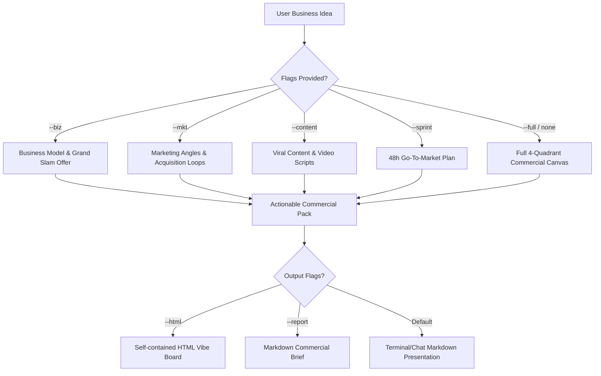

# Vibe Storm

Turn raw ideas and hunches into validated commercial concepts, irresistible offers, growth marketing loops, viral content matrices, and 48-hour go-to-market sprints for modern solopreneurs, creators, and agile operators.

Principles: **cash flow over complexity | concrete over generic | test before building | action-ready outputs**

## The Vibe Business Contract

Every ideation run establishes a bounded, commercial delivery contract:
- **The Vibe Pitch:** 1-sentence value proposition (Target Audience + Urgent Pain + High-Value Transformation).
- **The Core Offer & Wedge:** Hyper-specific initial entry point, pricing model, and unfair competitive moat.
- **Anti-Scope:** Explicit traps, operational overhead, and low-ROI distractions **NOT** to pursue at launch.
- **Day-1 Cashflow Test:** Concrete 24-hour validation experiment to prove willingness to pay before sinking time into operations or development.

## Proportional Behavior

- **Zero-delay kickoff:** Never interrogate the user with a 10-question corporate survey. Take the raw prompt, assume smart commercial defaults, and deliver the initial canvas immediately.
- **1 Clarification rule:** Ask at most ONE high-leverage question only if the core target market or monetization model is fundamentally ambiguous.
- **Anti-Fluff mandate:** Never output generic platitudes like "leverage social media" or "provide great service". Always provide exact hook copy, specific customer watering holes, realistic pricing tiers, and copyable prompt templates.

## Engines & Modes

Activate specific modules via flags, or run `--full` (default when no sub-flag is specified):

```text
/vibe-storm <topic/idea> [--biz] [--mkt] [--content] [--sprint] [--full] [--html] [--report]
```

### 1. Business Engine (`--biz`)

Formulate commercially viable business models across 5 archetypes (Productized Service, Digital Asset, AI Agency, Niche Brand, or Micro-SaaS):
1. **The Wedge Strategy:** Find the single most urgent pain point a customer will pay $19-$499+ to solve immediately.
2. **Grand Slam Offer:** Define the dream outcome, time-to-value shortcut, perceived likelihood of achievement, and risk-reversal guarantee.
3. **Monetization Mechanics:** Pricing structure (recurring monthly retainer, one-time digital purchase, pay-per-result, or tiered subscription) and unit economics (gross margins, CAC assumptions).
4. **Day-1 Cashflow Test Blueprint:** A 24-hour validation protocol (Pre-order landing page, 1:1 Loom DM concierge, or $1 reservation test).

### 2. Marketing Engine (`--mkt`)

Architect high-leverage customer acquisition channels and conversion hooks:
1. **Positioning & Angles:** The unique reason why target customers must choose this over existing alternatives.
2. **The Hook-Offer-Angle Matrix:** 3 distinct messaging angles:
   - *Pain-Agitation:* Highlighting wasted hours, hidden costs, and operational frustration.
   - *Dream-Transformation:* Achieving a 10x business or personal outcome in days, not months.
   - *Contrarian:* Challenging an established industry norm ("Why traditional agencies are obsolete").
3. **Customer Watering Holes:** 3 specific communities where the target buyers actively gather (exact subreddits, LinkedIn groups, X circles, niche forums).
4. **Lead Magnet / Trojan Horse:** Free high-value resource or mini-tool designed to capture qualified leads.

### 3. Content Engine (`--content`)

Generate high-retention content and sales-driven distribution assets:
1. **Content That Sells (4 Pillars):**
   - *Pain-Agitation & Education:* Exposing the hidden costs of the status quo.
   - *Proof & Transformation:* Customer case studies, before-and-after breakdowns.
   - *Behind-The-Scenes (Build in Public):* Honest metrics, learnings, and founder journey.
   - *Direct Call-to-Action (CTA):* Frictionless invitation to buy or book a demo.
2. **Format Multiplier (1 Insight -> 4 Formats):**
   - 1 High-Converting Long-form Post (LinkedIn / Facebook / Newsletter).
   - 1 High-Engagement X/Twitter Thread.
   - 2 Short-form Video Scripts (TikTok/Reels/Shorts) with 3-second visual hooks.
   - 1 Visual Infographic / Carousel Slide Outline.
3. **Actionable Content Prompt Packs:** Ready-to-paste prompts for AI image, copy, and video tools.

### 4. Go-To-Market Sprint Engine (`--sprint`)

Construct an aggressive 48-Hour Go-To-Market (GTM) execution plan:
1. **The 48-Hour GTM Roadmap:**
   - *Hours 0-12:* Offer definition, pricing structure, and 1-page sales presentation / landing page.
   - *Hours 12-24:* Core product / service asset packaging (templates, automated workflow, or MVP).
   - *Hours 24-36:* Checkout / payment gateway setup (Stripe, VietQR, SePay) + onboarding flow.
   - *Hours 36-48:* Soft launch outreach to 50 targeted prospects to secure the first paying customer.
2. **No-Code / AI-Native Toolstack:** Recommended minimal stack (Framer/Carrd/Webflow, Stripe/SePay, Make/Zapier/Claude).
3. **Execution Prompt Packs:** Ready-to-copy prompts for copywriting, landing page design, and outreach scripts.

## Authoritative Workflow



## HTML Vibe Board (`--html`)

When `--html` is passed, generate an interactive, self-contained HTML Vibe Board:
- Write `vibe-board.html` in the current workspace or `./reports/`.
- Zero external dependencies: embedded CSS/JS, modern dark/light styling.
- Interactive tabs: Business Canvas, Marketing Matrix, Content Sprint, and 48h GTM Roadmap.
- Interactive "Copy Prompt" buttons for all sales copy, outreach scripts, and prompts.

## Advisory Supervision (`--advice`)

When `--advice` is present, run a critical commercial advisory self-review:
- **Unit economics reality:** Are the customer acquisition costs (CAC) sustainable relative to lifetime value (LTV)?
- **Offer strength:** Is the value proposition compelling enough that buyers feel stupid saying no?
- **Execution simplicity:** Can this realistically launch in 48 hours without getting bogged down in complexity?

## Ultra Verifier Mode (`--ultra`)

When `--ultra` is present, evaluate 5 competing business angles in parallel:
1. **High-Ticket Productized Service:** Immediate cash flow, zero software dev, client retention.
2. **Digital Assets & Knowledge:** High margin, zero inventory, passive scalability.
3. **Micro-SaaS / AI Wrapper:** Recurring subscription, high valuation multiple, automated ops.
4. **Niche E-commerce / D2C:** Physical/digital blend, viral short-form marketing, passionate subculture.
5. **AI Operations Agency (AI Ops):** B2B workflow automation, monthly retainer, high switching costs.

Score each on speed-to-revenue, profit margin, and execution complexity, presenting the winning angle with a comparative ranking table.
