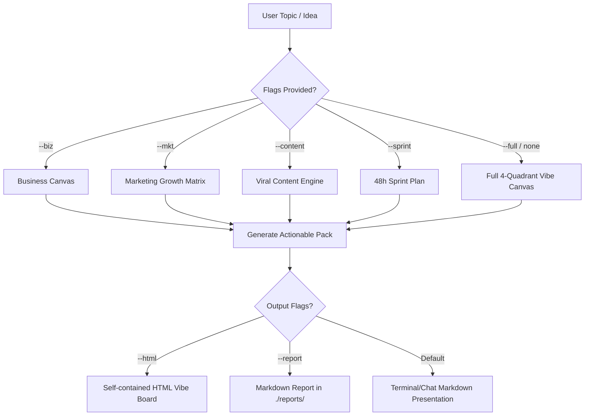

# Vibe Storm

Turn raw ideas and hunches into validated commercial concepts, growth hooks, viral content matrices, and 48-hour execution sprints for the vibe coding and solopreneur era.

Principles: **speed over ceremony | concrete over generic | test before code | prompt-ready outputs**

## The Vibe Working Contract

Every ideation run produces a bounded, actionable commercial contract:
- **The Vibe Pitch:** 1-sentence value proposition (Niche + Pain Point + Transformation).
- **The Wedge & Moat:** Hyper-specific entry point and unfair advantage in the AI era.
- **Anti-Scope:** Explicit traps, premature optimizations, and features **NOT** to build in MVP.
- **Day-1 Smoke Test:** Concrete validation experiment to verify willingness to pay before building.

## Proportional Behavior

- **Zero-delay kickoff:** Never interrogate the user with a 10-question survey. Take the raw prompt, assume smart defaults, and deliver the initial canvas immediately.
- **1 Clarification rule:** Ask at most ONE high-leverage question only if the core domain or monetization model is fundamentally ambiguous.
- **Anti-Fluff mandate:** Never output generic platitudes like "leverage social media" or "provide excellent service". Always provide exact hook copy, specific target subreddits/communities, pricing tiers, and copyable prompt templates.

## Engines & Modes

Activate specific modules via flags, or run `--full` (default when no sub-flag is specified):

```text
/vibe-storm <topic/idea> [--biz] [--mkt] [--content] [--sprint] [--full] [--html] [--report]
```

### 1. Business Engine (`--biz`)

Formulate lean business models with immediate monetization potential:
1. **The Wedge Strategy:** Find the single smallest problem a buyer will pay $9-$99/month to solve today.
2. **Monetization Mechanics:** Pricing tier, recurring billing trigger, or productized service tier.
3. **Unit Economics Hypothesis:** Estimated CAC channel, LTV assumption, and AI API gross margin.
4. **Day-1 Smoke Test Blueprint:** A 24-hour test (Pre-order page, Loom DM outreach, or Concierge MVP).

### 2. Marketing Engine (`--mkt`)

Architect organic and guerrilla distribution channels:
1. **Growth Loops:** Engineering-as-marketing (free tool/calculator), viral referral loops, or user-generated asset sharing.
2. **Hook-Offer-Angle Matrix:** 3 distinct angles:
   - *Pain-Driven:* Exposing expensive manual friction and wasted hours.
   - *Dream-Driven:* Achieving 10x output in 10 minutes with AI.
   - *Contrarian:* Busting an industry sacred cow ("Stop doing X").
3. **Guerrilla Distribution Map:** 3 specific online watering holes where the ICP gathers (exact subreddits, X circles, niche communities, Discord groups).

### 3. Content Engine (`--content`)

Generate high-retention content and viral distribution assets:
1. **Content Pillars:**
   - *Build in Public:* Transparent metrics, failures, and technical milestones.
   - *Tactical How-To:* Actionable workflows that teach a specific skill.
   - *Hot Takes:* Opinionated industry perspectives that provoke constructive debate.
   - *Customer Proof:* Before-and-after transformation stories.
2. **Format Multiplier (1 Insight -> 4 Assets):**
   - 1 Deep Dive (Newsletter/LinkedIn Article).
   - 1 High-Engagement X/Twitter Thread.
   - 2 Short-form Video Scripts (TikTok/Reels/Shorts) with 3-second visual hooks.
   - 1 Visual Slide / Carousel Outline.
3. **Ready-to-Paste AI Prompt Pack:** Prompts to feed directly into image/copy tools.

### 4. Rollout Engine (`--sprint`)

Construct an aggressive 48-Hour AI-native execution plan:
1. **The 48-Hour Vibe Roadmap:**
   - *Hours 0-4:* One-page functional spec + wireframe mockup.
   - *Hours 4-24:* Core "Happy Path" functional MVP using AI code generators.
   - *Hours 24-36:* Landing page copy, checkout integration (Stripe/SePay), and analytics.
   - *Hours 36-48:* Soft launch to 50 targeted beta users and live feedback loop.
2. **AI-Native Toolstack:** Recommended minimal stack (Next.js/FastAPI, Supabase, Tailwind, AI SDKs).
3. **Direct Handoff Prompts:** Ready-to-copy system prompts for coding agents (Cursor, Claude Code, Antigravity).

## Authoritative Workflow



## HTML Vibe Board (`--html`)

When `--html` is passed, generate an interactive, self-contained HTML Vibe Board:
- Write `vibe-board.html` in the current workspace or `./reports/`.
- Self-contained: embedded CSS/JS, modern dark/light styling, zero external dependencies.
- Include interactive tabs for Business, Marketing, Content, and Sprint.
- Include "Copy Prompt" buttons for all AI prompt packs.
- See `references/html-vibe-board.md` for template and structural patterns.

## Advisory Supervision (`--advice`)

When `--advice` is present, run a critical advisory self-review:
- **Unit economics reality:** Will API costs exceed customer willingness to pay?
- **Distribution feasibility:** Is the founder reliant on an audience they do not have?
- **Anti-scope enforcement:** Has scope creep sneaked into the 48-hour sprint?

## Ultra Verifier Mode (`--ultra`)

When `--ultra` is present, evaluate 5 distinct ideation angles in parallel:
1. **Conservative B2B:** Low churn, high price, workflow integration.
2. **Viral B2C / Creator:** High volume, social proof, freemium mechanics.
3. **Contrarian AI-Native:** Novel model capabilities, zero human-in-the-loop.
4. **Guerrilla Solopreneur:** Zero-budget distribution, high personal leverage.
5. **Productized Service Bridge:** Manual-first high-ticket to automated SaaS.

Score each on speed-to-revenue, moat durability, and execution risk, presenting the winning angle with a comparative ranking table.

## Downstream Execution Handoff (Standalone)

This skill is completely standalone. To execute any generated outputs:
- **To build the software MVP:** Copy the generated 48h Sprint Prompt directly into **Cursor**, **Claude Code**, or **Antigravity** (see `references/execution-bridge.md`).
- **To write high-converting copy:** Use the embedded copy templates in `references/standalone-prompts.md`.
- **To design branding & UI:** Feed the generated design spec into **v0**, **Stitch**, or **Lovable**.
- **To setup payments:** Follow the integration recipes in `references/execution-bridge.md`.
