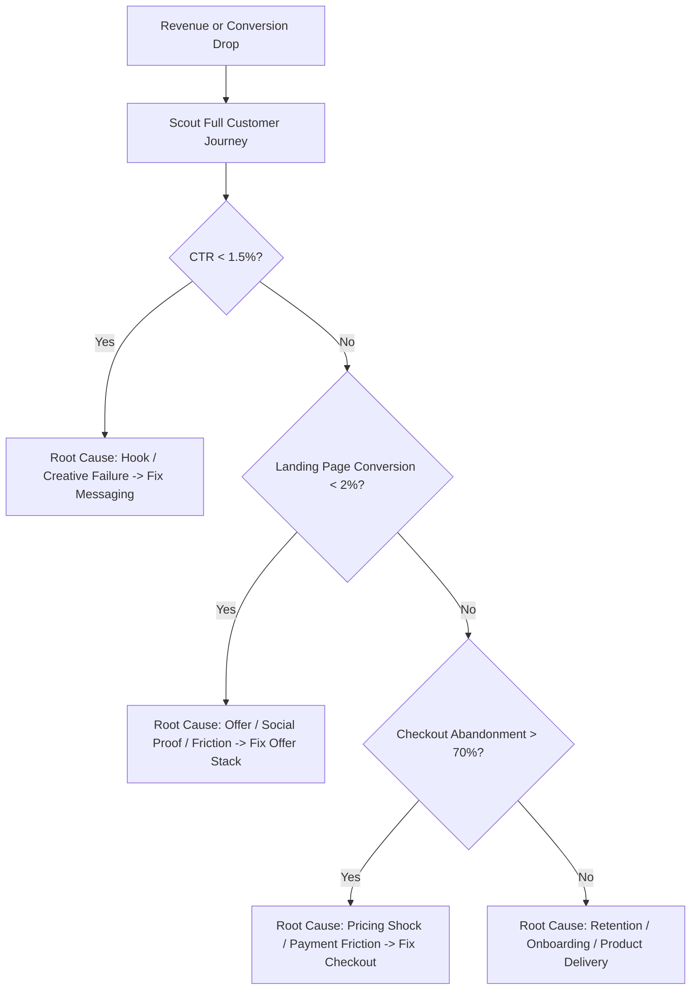

# Business Brainstorm Frameworks & Operational Protocols

Detailed operational protocols and reference models for `vibe-storm` across the 5-stage agent pipeline (`brainstorm -> research -> scout -> plan -> cook`).

---

## 1. The Bounded Business Contract: Archetype Templates

### Example A: Productized Service / AI Agency
- **Outcome:** Secure 10 monthly retainer clients at \$1,500/month (\$15k MRR) for an AI Operations Agency within 60 days.
- **Constraints:** Solo operator bandwidth (max 15 clients), zero paid advertising budget, delivery must be semi-automated via Make/Zapier.
- **Non-goals:** Custom enterprise software development, on-site consulting, or 24/7 dedicated support.
- **Acceptance Criteria:** 10 signed contracts with first month paid via Stripe; onboarding completed in under 24 hours per client.

### Example B: Digital Asset / Course / Community
- **Outcome:** Generate \$10,000 in launch revenue from a high-value Notion template & video course for real estate agents.
- **Constraints:** Total build + launch timeline under 14 days; gross profit margin >90%.
- **Non-goals:** Individual 1-on-1 coaching, physical workbook printing, custom portal development.
- **Acceptance Criteria:** 100 sales at \$99; refund rate <5%; landing page conversion rate >=3.5%.

---

## 2. Business Failure & Bottleneck Diagnosis (Bug Routing)

When a commercial initiative fails or revenue drops, run this systematic root-cause diagnostic:

### The Diagnostic Matrix
| Symptom | Suspected Root Cause | Proof Evidence | Corrective Intervention |
| :--- | :--- | :--- | :--- |
| Low ad/post engagement | Weak Hook / Boring Angle | Low CTR, 3s dropoff | Test 5 contrarian visual hooks |
| High traffic, zero sales | Weak Offer or Trust Deficit | High bounce, zero cart adds | Add risk reversal, simplify promise |
| Carts created, no payment | Payment friction / Price shock | Cart abandon rate >70% | Add local payment (VietQR/SePay), remove hidden fees |
| High 30-day churn | Mismatched expectations | Refund requests, low login | Improve Day-1 onboarding checklist |

---

## 3. Option Exploration Protocol

When presenting strategic approaches, evaluate on the **Worst-Case Plausible Condition**:

1. **Approach A: Organic Content & Community Loop**
   - *Load-bearing assumption:* Target buyers consume and share educational video content.
   - *Fails first when:* Algorithm reach changes or production cadence drops below 5 posts/week.
2. **Approach B: Direct 1-on-1 Outbound & Strategic DMs**
   - *Load-bearing assumption:* Prospect profiles are publicly discoverable on LinkedIn/X.
   - *Fails first when:* Connect rates fall below 15% or reply-to-lead ratio collapses.
3. **Approach C: Paid Advertising & Rapid Funnel**
   - *Load-bearing assumption:* Customer Lifetime Value (LTV) supports a CAC >= \$50.
   - *Fails first when:* Ad platform CPMs spike or offer conversion drops below breakeven.

---

## 4. The Grand Slam Offer & Value Formula

$$\\text{Perceived Value} = \\frac{\\text{Dream Outcome} \\times \\text{Perceived Likelihood of Achievement}}{\\text{Time Delay} \\times \\text{Effort & Sacrifice}}$$

- Increase perceived value by guaranteeing the outcome and minimizing user effort.
- Anchor against high-cost alternatives (\$2,000/mo employee vs \$299/mo automated solution).
